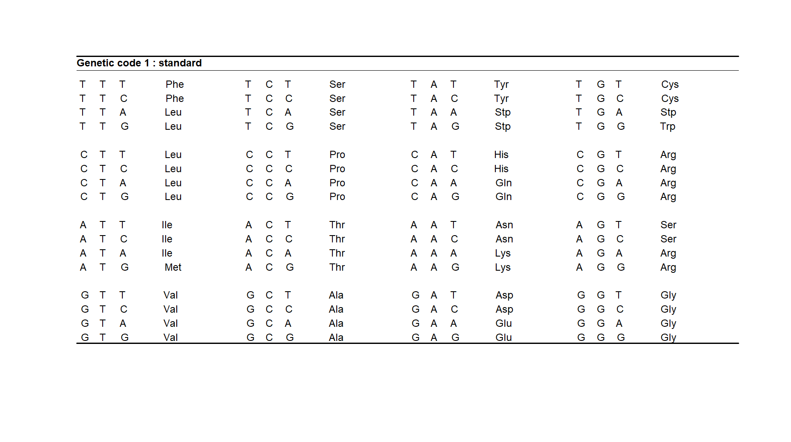

```{r,echo=FALSE, include=FALSE, warning=FALSE, message=FALSE}

Base <- Sys.getenv("USERPROFILE")
Folder <- "OneDrive - Università degli Studi di Milano/DATASET REPOSITORY"
RDataFolder <- "OneDrive - Università degli Studi di Milano/RDATA"
ProfileFile <- ".Rprofile"
FunctionsFile <- "FUNZIONI.R"

source(file.path(Base, RDataFolder, ProfileFile))
source(file.path(Base, RDataFolder, FunctionsFile))
```


---
title: "Analisi Genomica con R"
output: html_document
---

# Tabella dei codoni

Un codone è una tripletta di basi nucleiche.

Un gene che codifica le proteine inizia con un codone "ATG", seguita da un numero intero di codoni  che codificano gli aminoacidi, e termina con un codone "TGA", "TAA" o "TAG". 



Si riconosce facilmente il codone di inizio (Met) e quelli di fine (Stp)


## Ricerca dei codoni di inizio e fine in una sequenza di DNA 

```{r, warning=FALSE, message=FALSE}
accession_id <- "3022387165"
database_name <- "nuccore"

FASTA_1 <- entrez_fetch(db = database_name, id = accession_id, rettype = "fasta", retmode = "text")
```

Utiliziamo la mia Super-Funzione FASTA per visualizzare il contenuto del fetch:

```{r, warning=FALSE, message=FALSE, results='asis'}
FASTA(FASTA_1,500)
```

<br>

Ora utiliziamo la mia Super Funzione START_STOP per evidenziare le posizioni degli start e degli stop

```{r, warning=FALSE, message=FALSE, results='asis'}
START_STOP(FASTA_1,500)
```

<br>

I codoni di inizio e di stop in una sequenza di DNA possono risiedere in uno dei tre possibili frame di lettura (reading frame)

Per capirci, immagina la frase: ATGCCAGTC

1. Frame di Lettura +1 (Parti da subito)
Frase: A T G C C A G T C
Lettura:
ATG (prima parola)
CCA (seconda parola)
GTC (terza parola)

2. Frame di Lettura +2 (Parti dalla seconda lettera)
Frase: A T G C C A G T C
Lettura:
TGC (prima parola)
CAG (seconda parola)
TC (resta solo 'TC', non è una parola completa di tre lettere, la scartiamo)


3. Frame di Lettura +3 (Parti dalla terza lettera)
Frase: A T G C C A G T C 
Lettura:
GCC (prima parola)
AGT (seconda parola)
C (resta solo 'C', non è una parola completa di tre lettere, la scartiamo)

<br>

## ORF e ricerca del GENE

Quando troviamo un pezzo di DNA che inizia con un segnale di start e finisce con uno di stop, e tutto è allineato correttamente nello stesso modo di lettura, lo chiamiamo 'Open Reading Frame' (ORF). Un ORF è un buon indizio che lì c'è un gene.

```{r, warning=FALSE, message=FALSE}
ORF(FASTA_1,500)
```

Notare che le posizioni di Start and Stop non coincidono totalmente con quelle evidenziate dalla funzione START_STOP perchè questa a differenza della funzione ORF non considerava i tre diversi frame di lettura.


