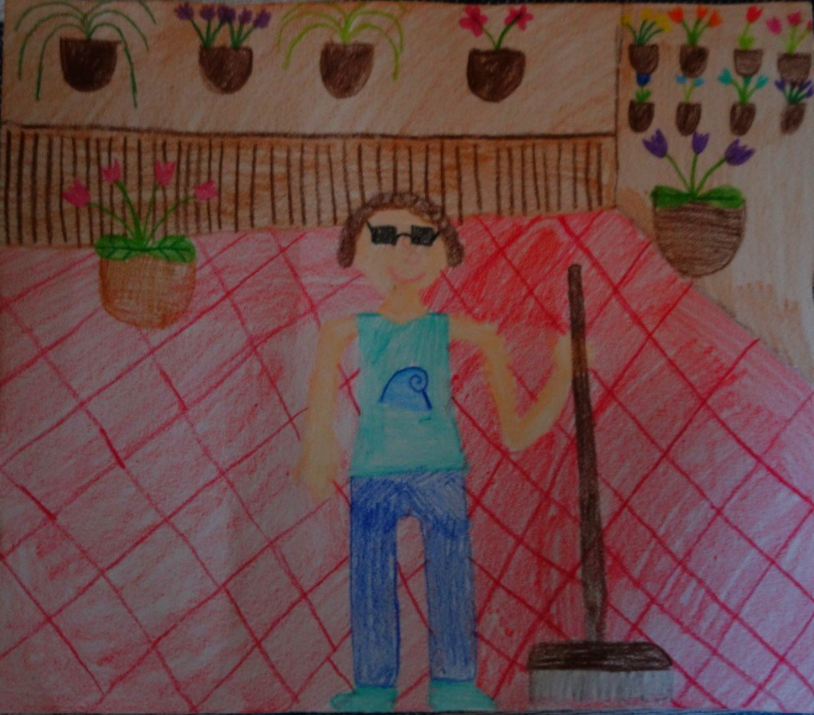

```{r,echo=FALSE, include=FALSE, warning=FALSE, message=FALSE}

Base <- Sys.getenv("USERPROFILE")
Folder <- "OneDrive - Università degli Studi di Milano/DATASET REPOSITORY"
RDataFolder <- "OneDrive - Università degli Studi di Milano/RDATA"
ProfileFile <- ".Rprofile"
FunctionsFile <- "FUNZIONI.R"

source(file.path(Base, RDataFolder, ProfileFile))
source(file.path(Base, RDataFolder, FunctionsFile))
```

---
title: "Benvenuti nel Sito di Bioinformatica"
output:
  html_document:
    css: styles.css
---


## Esplorando la Bioinformatica con R

Ciao sono Maurizio.

<div class="image-row-container">
  {width=200px height=auto}
  {width=220px height=auto}
</div>


Benvenuti nel sito dedicato alla bioinformatica, dove esploreremo analisi di dati biologici complessi utilizzando il potente linguaggio di programmazione R.

Questo è un sito di miei appunti di "viaggio" nel mondo della Bioinformatica per cercare di riassumere le cose più interessanti e gli esercizi utili ad esplorare questo mondo al confine tra la biologia, la genetica, la statistica e l'informatica.

---
Amo, cominciamo con qualcosa di base per poi capici meglio. Ho identificato alcuni principi chiave che vanno imparati a memoria come i principi della dinamica nella fisica:


<li> Tutti gli organismi cellulari (Batteri, Archea, Eucarioti come piante, animali, funghi) hanno un genoma composto esclusivamente da DNA. L'RNA (trascritto) serve come intermediario per esprimere le informazioni genetiche (mRNA, tRNA, rRNA).</li>

<li>I virus sono un'eccezione a questa regola generale degli organismi cellulari. Essi possono avere un genoma composto da DNA oppure da RNA</li>

<li>Un ORF (Open Reading Frame) è una sequenza di DNA o RNA che ha il potenziale per codificare una proteina.</li>

<li>Identificare gli ORF di una sequenza è importantissimo per:</li>
<ul>
<li>Organismi Cellulari (es. umani, batteri):Identificare i geni che producono proteine</li>
<li>Virus: Identifica le poche, ma cruciali, proteine che il virus deve produrre per replicarsi, assemblarsi e infettare le cellule ospiti.</li>
</ul>


<li>Il termine CODONE significa 3 nucleotidi. Il codice genetico è universale (quasi): le triplette di nucleotidi (codoni) che specificano gli amminoacidi sono le stesse in quasi tutti gli organismi viventi.</li>

<li>Ci sono 64 codoni possibili: 61 specificano amminoacidi e 3 sono codoni di stop.</li>

<li>Il codone ATG (nel DNA) o AUG (nell'RNA) sono i codoni di inizio per la traduzione</li>

<li>La bioinformatica dipende dall'accesso a vaste raccolte di dati. I database pubblici (es. NCBI, UniProt, PDB) sono essenziali per scaricare, confrontare e analizzare sequenze di DNA, RNA </li>

<li>L'allineamento di sequenze è la base per confrontare due o più sequenze di DNA/RNA/proteine. Permette di identificare regioni conservate (simili) che suggeriscono una funzione comune o un'origine evolutiva, e regioni divergenti (diverse) che possono spiegare variazioni funzionali o adattamenti.</li>

<BR>

Procarioti	Eucarioti	Virus


<BR>

Altre cose fondamentali per capirsi:

L'RNA polimerasi (che è un enzima) legge un filamento specifico dei due che compongono la doppia elica del DNA: legge il filamento detto "stampo".

l'RNA polimerasi sintetizza poi una molecola mRNA (RNA messaggero) detto "trascritto"

mRNA (RNA messaggero): Questo è il trascritto originale del gene, prodotto tramite trascrizione dal DNA nel nucleo. L'mRNA è una molecola che contiene sequenze complementari al filamento stampo e contiene Uracile (U) al posto della Timina (T). 

cDNA (complementary DNA): Il cDNA è una copia del mRNA, ma in formato DNA. Viene sintetizzato in laboratorio (o in silico, cioè in un database) a partire da un mRNA maturo attraverso un processo chiamato trascrizione inversa. Il cDNA è contiene Timina (T) e non Uracile (U). NB: Le sequenze che si scaricano dei trascritti con getBM(attributes = c("ensembl_transcript_id", "cdna"), ...) sono sequenze di cDNA (complementary DNA).

<BR>
     
## Dove puoi arrivare?

Ti mostro alcune ricerche:

Questa è una ricerca ampia che restituisce sequenze ID nucleotidiche di vari ceppi e tipi di influenza.

```{r, warning=FALSE, message=FALSE}
results <- entrez_search(db = "nuccore", term = "influenza virus", retmax = 30)
print(results$ids)
```


Questa ricerca è più mirata: vogliamo le sequenze ID del gene CFTR ([Gene]) specificamente dall'Homo sapiens ([Organism]) e che siano di tipo mRNA RefSeq:

```{r, warning=FALSE, message=FALSE}

results <- entrez_search(db = "nuccore",
                                       term = "CFTR[Gene] AND Homo sapiens[Organism] AND NM_",
                                       retmax = 10)
print(results$ids)
```

Ricerca del Genoma Umano 

```{r, warning=FALSE, message=FALSE}

results <- entrez_search(db = "nuccore", term = "Homo sapiens[Organism] AND chromosome 1 AND complete genome AND RefSeq", retmax = 3)

print(results$ids)
```

Il genoma umano è un progetto in continuo aggiornamento. Nel corso del tempo, sono state prodotte diverse versioni di riferimento dell'assemblaggio del genoma (chiamate "assemblies"). Ogni nuova versione incorpora dati di sequenziamento migliorati, corregge errori, riempie lacune e raffina le annotazioni.
La versione più recente e consolidata denominata NC_000001.11 ma non corrisponde a nessuno dei tre ID elencati:

```{r, warning=FALSE, message=FALSE}
summary_result <- entrez_summary(db = "nuccore", id = 1519246517)
summary_result$accession
summary_result <- entrez_summary(db = "nuccore", id = 1519311725)
summary_result$accession
summary_result <- entrez_summary(db = "nuccore", id = 1519246553)
summary_result$accession
```

Vabbè, poco male, lo cercheremo direttamente con l'Accession ID (NC_000001)


```{r, warning=FALSE, message=FALSE}
results <- entrez_search(db = "nuccore",term = "NC_000001[Accession]", retmax = 1)
print(results$ids)
```

Ora che ho l'ID provo a isolare una porzione di Genoma Umano in formato fasta:

```{r, warning=FALSE, message=FALSE, results='asis'}
uid_chr1 <- "568815597"
database_name <- "nuccore"

start_position <- 10000
end_position <- 12000


WOW <- entrez_fetch(db = database_name,
                                       id = uid_chr1,
                                       rettype = "fasta",
                                       retmode = "text",
                                       seq_start = start_position,
                                       seq_stop = end_position)

FASTA(WOW)
```


